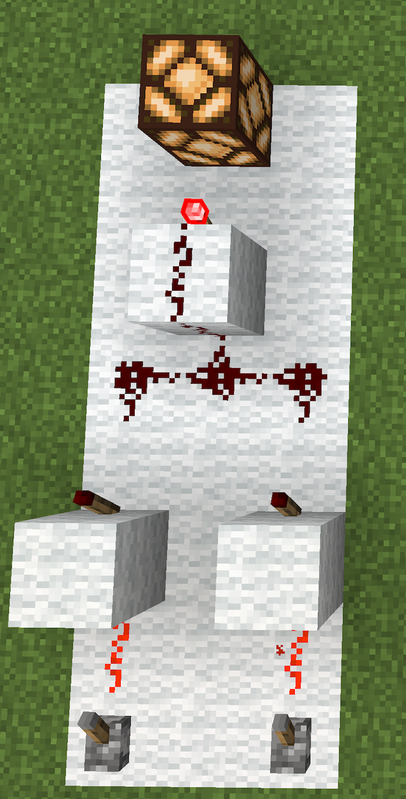

This is a report on my work on the Sigil language.
Sigil was designed to allow simulation and testing of Redstone,
which is a Turing-complete type of circuitry in the game Minecraft.
The goal was to create a layout-agnostic tool for describing and simulating redstone circuits.

## \includegraphics[width=0.3in]{images/transp_logo.png} Recap: problem statement

Redstone is a really powerful subsystem of Minecraft,
and it has been used by some players to create working computers.
However, without proper tooling, this is exceptionally painful.
Testing a circuit by setting all the inputs as desired then checking that all outputs are as desired is slow and error-prone.
Additionally, while the community has attempted to share information amongst itself on redstone development,
it typically does so by exchanging graphical blueprints or screenshots from the game.
This mingles logical and layout information and makes circuits difficult to reason about.
My goal was to create something Verilog-y in its flavor that could be applied to redstone.

## \includegraphics[width=0.3in]{images/transp_logo.png} The Sigil language

Sigil has two basic kinds of blocks in the language: modules, which are reusable units of redstone logic,
and system tasks, which are ways to test and print what a module is expected to do at a given timestamp.

Within a module, a user may represent the logical presence of a redstone component from Minecraft
(which are: dust, torches, comparators, repeaters, and clocks).
Clocks are included,
despite not corresponding to an item in the game as do other components,
because they are typically created manually in-game,
by placing and breaking blocks in specific sequences.

Hence, Sigil components perform the following functions:

* **Dust** applies a union to its inputs
* **Torches** apply a union to their inputs then negate it
* **Comparators** may be either subtract or compare comparators.
* **Repeaters** delay and extend a pulse
* **Clocks** provide a pulse of a desired duration within a desired period

A module accepts at least one input and emits at least one output.
Users then control to which internal components and modules the input(s) are connected,
and from which internal components and modules the outputs are derived.

## \includegraphics[width=0.3in]{images/transp_logo.png} Implementation

The implementation of Sigil is, by design, as hacky as it can get.
There is a hyper-primitive frontend and a minimal backend.
One of the reasons for this is that Sigil is so simple that it does not actually need an AST,
so a heavy-duty parser that constructs one,
while it may have been nice, would have been excessive.

The frontend is line-by-line regex matching of an input file that simply ignores any input that is not well-formed.
The cute way of saying this is anything you want can be a comment except the language's constructs.
This is possible because it only needs to match six line types:

* **module declarations:** `module [module name]([inputs]) -> [outputs] {`
* **component instantiations:** `[component type] [identifier];`
* **module instantiations:** `[module type] [identifier]([args]);`
* **assignments:** `[identifier] = [identifier];`
* **module closes:** `}`
* **system tasks:** `$[function name]([arguments]);`

The frontend, having performed regex matching with some capture groups,
then generates C++ code that uses the backend.

The backend is a minimal library that provides the logical functionality of the aforementioned redstone components.
The set of features the library provides can be found in `backend/sigil.hh`
(this is included in every generated file,
and every generated executable links against `backend/sigil.cc`).
Every component is modeled as a lambda that has captured its inputs, that may return its outputs at a desired timestamp.
As such, the code generated for module definitions is a `make_` function that returns such a lambda.
System tasks are emitted as calls to `assert` or `std::cout` of the desired function with the desired outputs.
The way generated code looks is modeled in the `backend/tests/` directory of the repository.

## \includegraphics[width=0.3in]{images/transp_logo.png} Using Sigil

Having written a Sigil file,
a user may generate an executable from it by running `./runner.sh [file-path]/[filename]` from the Sigil repo root.
This will create a `sigil_gend_[filename].cc` file in the `compile` directory,
which is the generated C++,
and a `sigil_exec_[filename]` file,
which is the executable to be run to test their Sigil-described redstone.


The runner flow is depicted in Figure 1.
Programs composing the compilation flow are shown as blue circles, with files shown as red rectangles.

## \includegraphics[width=0.3in]{images/transp_logo.png} Related work

Sigil is inspired by hardware description languages,
including Verilog.
Real electrical engineers have been building circuits for a while now,
and at some point they realized that they could do better than graphical blueprints for large, complicated systems.
The redstone people simply have to catch up.

Much of Sigil's syntax is basically taken from Verilog.
I used a version of the Verilog standard from [here](https://www.eg.bucknell.edu/~csci320/2016-fall/wp-content/uploads/2015/08/verilog-std-1364-2005.pdf).
This includes the way components are declared inside modules,
that connections between components are represented by `=` (Verilog uses `<=` but same idea),
that modules are called modules,
and that system tasks are (a) called system tasks and (b) prefixed by a `$`.

The way module inputs and outputs are described is based on Python and modern versions of C++.
I preferred this to the Verilog way,
because it distinguishes inputs and outputs more clearly from components within a module.

There has been work on using HDLs for redstone,
however they tend to use actual Verilog.
For instance, [this](https://www.semanticscholar.org/paper/Incremental-Improvements-on-the-Placement-and-of-Nguyen/782d4b835e839c4b0907ba8a6d6c87064a3f54e5) paper uses Verilog to lay out redstone circuits subject to Minecraft's constraints.

You may ask at this point why I chose to create a language instead of trying to support redstone in Verilog somehow.
This is a fair question.
My view is that Verilog is too broad and too powerful for redstone.
Timing in redstone is not continuous, it is discrete.
The number of components is much smaller in redstone,
and the operations they provide are much more basic,
than the capabilities of Verilog.
For instance, Verilog provides addition.
Redstone doesn't.
As such, I felt a more tailored solution was appropriate.

## \includegraphics[width=0.3in]{images/transp_logo.png} Evaluation

The implementation of this language was both harder and easier than I anticipated.
Building the backend was not nearly as difficult as I thought it would be:
about a day and a half of hacking got me a working backend and some tests demonstrating what I wanted to test.
However, building the frontend was far more difficult than I had expected.

### \includegraphics[width=0.2in]{images/transp_logo.png} Successes

The language can, in practice,
model a redstone circuit and show what the circuit will output at a given timestamp given a set of inputs.
I was able to debug a 4-bit adder circuit, both using the backend library and using the language itself,
far more easily than it would have been if I were simply building the circuits in Minecraft.

As an example, consider the following redstone gate in Figure 2.
Without looking at the subsequent code snippet, can you tell what it does?

{.class height=3in}

This is clearly hard to reason about.
Details are easy to miss.
It's unclear whether all that redstone dust matters.
The purpose of the module is not even mentioned -- that would require placing signs in the game,
and the whole thing would be a pain.

In fact this is an AND gate, the first example I provide in my onboarding doc.
In Sigil, it is described as follows:
```
module and(left, right) -> result {
    torch torch_l;
    torch torch_r;

    torch_l = left;
    torch_r = right;

    torch torch_c;
    torch_c = torch_l;
    torch_c = torch_r;

    result = torch_c;
}
```
This states clearly what the purpose of the module is,
what interface it provides,
and which components are essential to its logical function.
**This is the key win of Sigil.**

Users do not have to think about layouts at all while writing the language,
and the circuit descriptions in Sigil correspond quite closely to the mathematical representation of the circuit's logic
(see `docs/sigil_guide.md` for examples of this).

Additionally, the scrappy nature of the language's implementation is an advantage in some sense.
This is not the four quintillion lines of LLVM or Linux.
That means getting more implementers on board is easy.

And the language is itself quite simple.
That is a strength,
because it means it's easier to start using the language.
There are basically two things any line of code can do (create a module or component, assign to a module or component or output)
inside of a module, and two things they can do outside a module (assert and print).

### \includegraphics[width=0.2in]{images/transp_logo.png} Limitations

I focus on limitations because this is a source of any future work.
I feel warm and fuzzy inside because of the Successes section but it is important to note what was missing.

There were _many_ limitations I encountered based on my own design.

First, the language does not model the distance-based attenuation of redstone signals in Minecraft.
This comes with the turf of being layout-agnostic,
but it is a problem given that signal decay of this sort is the single most significant limitation of redstone.

Second, the language does not model the sort-of-analog nature of redstone signals in Minecraft.
Sigil treats all signals as binary,
but in the game signals have a strength between 0 and 15.
Treating signals as binary renders comparators more or less superfluous,
because comparators operate on those intermediate values between 0 and 15.
My decision simplifies the logic of Sigil,
and it also tracks with being layout agnostic
(because the primary source of changes in 'analog' signal strength is the distance-based attenuation),
but it limits the extent to which Sigil can model problems in Minecraft.

_However_, I will note that in the spirit of the language,
it is probably best to leave the question of signal attenuation over a distance and layouts to an automated system,
leaving a declarative system for logically important components.

Third, my design of the language focused on the actual redstone circuitry.
That made sense for the v0 that I have built out.
The formula of text-based description plus module reusability and composability is a win,
as noted.
However, the real secret sauce of any HDL for redstone _has to be the system tasks_, which I neglected.
System tasks are where true abstraction begins,
allowing users to describe and test circuit-level semantics beyond wire-level signals.
If I expand Sigil,
it will be with better and more advanced system tasks.

Part of the limitations of the system tasks comes from my hacky implementation of the frontend.
If I had a better system -- not regexes in C++, but even Flex and Bison if not a hand-rolled parser --
I could introduce far more powerful constructs, such as math.

And, of course,
the language lacks basically all the niceties you expect from a truly usable language,
such as thorough error handling
-- which currently usually means sheets of C++ compiler errors when the code Sigil generates is malformed
-- or the ability to have multiple Sigil files combined (think of C++ includes or Python imports).

## \includegraphics[width=0.3in]{images/transp_logo.png} Bottom Line

Sigil is a toy DSL, I will be the first to admit it.
However, despite its limitations,
it demonstrates the feasibility of modeling redstone in a formal language and the utility of such a tool.
We can move redstone into the future and disentangle it from Minecraft's visual mess.

